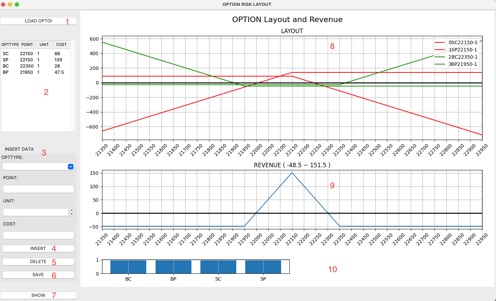

# optionProfit
# 目的：
- 整合同期所有選擇權未平倉口數的損益分布（不計交易成本）。
  
# 系統環境：
-  Python 3.9
-  GUI : tkinter
-  Module : pandas / matplotlib

# 使用方式：
- python opt_tkinter.py

# 合約LAYPUT:

# 參數說明：
- (1)LOAD OPTOI：loading /load_data/optionOI.xlsx
- (2)TreeView : 顯示(1)選擇權未平倉資訊
- (3)(4)InsertData : 依輸入(買賣型態, 合約點數, 口數, 成本點數）新增至(2)
- (5)Delete : 依TreeView選擇項目刪除
- (6)Save : 依TreeView維護後內容，儲存至/load_data/optionOI.xlsx
- (7)Show : 計算所有未平倉合約呈現(8)(9)(10)
- (8)所有未平倉合約layout
- (9)所有損益區間分部
- (10)BC/SC/BP/SP各型態口數統計
  
###### 買賣型態(BC: buy call / BP: buy put / SC: sell call / SP: sell put)    
